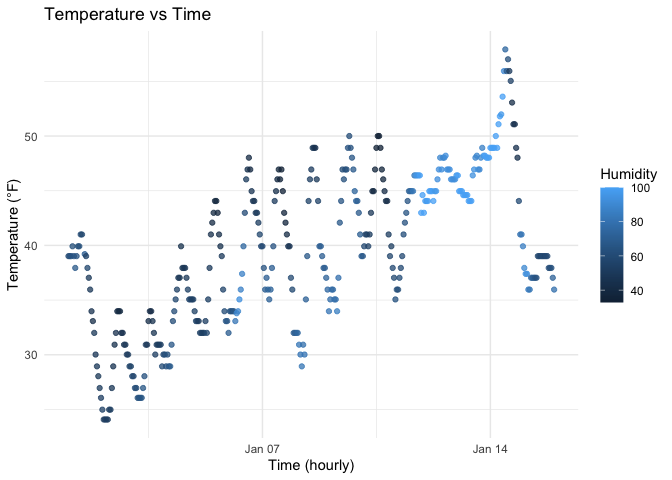

p8105_hw1_zn2220
================
Ziang Niu
2025-09-19

``` r
library(moderndive)
library(ggplot2)
library(tidyverse)
```

    ## ── Attaching core tidyverse packages ──────────────────────── tidyverse 2.0.0 ──
    ## ✔ dplyr     1.1.4     ✔ readr     2.1.5
    ## ✔ forcats   1.0.0     ✔ stringr   1.5.1
    ## ✔ lubridate 1.9.4     ✔ tibble    3.3.0
    ## ✔ purrr     1.1.0     ✔ tidyr     1.3.1
    ## ── Conflicts ────────────────────────────────────────── tidyverse_conflicts() ──
    ## ✖ dplyr::filter() masks stats::filter()
    ## ✖ dplyr::lag()    masks stats::lag()
    ## ℹ Use the conflicted package (<http://conflicted.r-lib.org/>) to force all conflicts to become errors

# Problem 1

Here is a summary of the dataset, including the names and some
indicators of the dataset.

``` r
summary(early_january_weather)
```

    ##     origin               year          month        day              hour      
    ##  Length:358         Min.   :2013   Min.   :1   Min.   : 1.000   Min.   : 0.00  
    ##  Class :character   1st Qu.:2013   1st Qu.:1   1st Qu.: 4.000   1st Qu.: 6.00  
    ##  Mode  :character   Median :2013   Median :1   Median : 8.000   Median :11.50  
    ##                     Mean   :2013   Mean   :1   Mean   : 8.039   Mean   :11.53  
    ##                     3rd Qu.:2013   3rd Qu.:1   3rd Qu.:12.000   3rd Qu.:17.75  
    ##                     Max.   :2013   Max.   :1   Max.   :15.000   Max.   :23.00  
    ##                                                                                
    ##       temp            dewp           humid           wind_dir    
    ##  Min.   :24.08   Min.   : 8.96   Min.   : 32.86   Min.   :  0.0  
    ##  1st Qu.:33.98   1st Qu.:19.94   1st Qu.: 51.34   1st Qu.:140.0  
    ##  Median :39.02   Median :26.06   Median : 61.67   Median :240.0  
    ##  Mean   :39.58   Mean   :28.06   Mean   : 65.48   Mean   :208.2  
    ##  3rd Qu.:44.96   3rd Qu.:35.06   3rd Qu.: 78.68   3rd Qu.:290.0  
    ##  Max.   :57.92   Max.   :53.06   Max.   :100.00   Max.   :360.0  
    ##                                                   NA's   :5      
    ##    wind_speed       wind_gust         precip            pressure   
    ##  Min.   : 0.000   Min.   :16.11   Min.   :0.000000   Min.   :1011  
    ##  1st Qu.: 5.754   1st Qu.:19.56   1st Qu.:0.000000   1st Qu.:1018  
    ##  Median : 8.055   Median :21.86   Median :0.000000   Median :1022  
    ##  Mean   : 8.226   Mean   :22.53   Mean   :0.002039   Mean   :1023  
    ##  3rd Qu.:11.508   3rd Qu.:25.32   3rd Qu.:0.000000   3rd Qu.:1027  
    ##  Max.   :24.166   Max.   :31.07   Max.   :0.190000   Max.   :1034  
    ##                   NA's   :308                        NA's   :38    
    ##      visib          time_hour                  
    ##  Min.   : 0.120   Min.   :2013-01-01 01:00:00  
    ##  1st Qu.: 9.000   1st Qu.:2013-01-04 19:15:00  
    ##  Median :10.000   Median :2013-01-08 12:30:00  
    ##  Mean   : 8.515   Mean   :2013-01-08 12:28:09  
    ##  3rd Qu.:10.000   3rd Qu.:2013-01-12 05:45:00  
    ##  Max.   :10.000   Max.   :2013-01-15 23:00:00  
    ## 

It has 358 rows and 15 columns.

Some head data can be shown here.

    ## # A tibble: 6 × 15
    ##   origin  year month   day  hour  temp  dewp humid wind_dir wind_speed wind_gust
    ##   <chr>  <int> <int> <int> <int> <dbl> <dbl> <dbl>    <dbl>      <dbl>     <dbl>
    ## 1 EWR     2013     1     1     1  39.0  26.1  59.4      270      10.4         NA
    ## 2 EWR     2013     1     1     2  39.0  27.0  61.6      250       8.06        NA
    ## 3 EWR     2013     1     1     3  39.0  28.0  64.4      240      11.5         NA
    ## 4 EWR     2013     1     1     4  39.9  28.0  62.2      250      12.7         NA
    ## 5 EWR     2013     1     1     5  39.0  28.0  64.4      260      12.7         NA
    ## 6 EWR     2013     1     1     6  37.9  28.0  67.2      240      11.5         NA
    ## # ℹ 4 more variables: precip <dbl>, pressure <dbl>, visib <dbl>,
    ## #   time_hour <dttm>

The mean temperature is 39.5821229 °F.

And the plot:

<!-- -->
